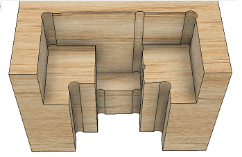
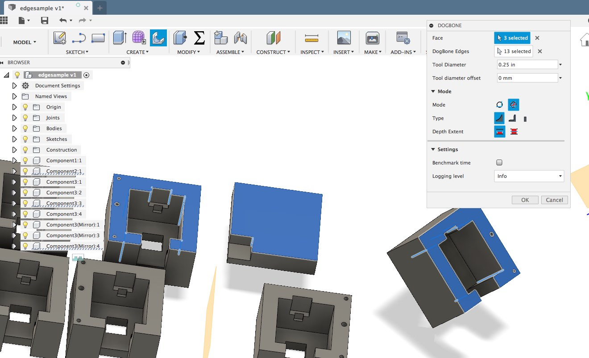
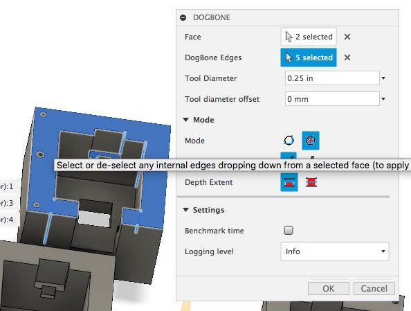

Dogbone addin for fusion 360
===
#  Installation note: 
The easiest way to install is to use Jerome Briot's installer, which you can get from the Fusion App store (utilities/add-ins/fusion App Store - [
Install scripts or addins from GitHub or GitLab](https://apps.autodesk.com/FUSION/en/Detail/Index?id=789800822168335025&appLang=en&os=Mac)) from the top menu in F360.
If you want to install manually, ensure that the folder name does include anything other than a-zA-Z0-9 (ie make sure "Dogbone" doesn't have a prefix or suffix)
# Version History
## Version 2.4
* added preview mode
* fixed issue with mortise mode not working
* fixed issue with multiple bodies in same component not generating dogbones 
## Version 2.3
* refactored folder and file structure to F360's python Add-in template
* fixed issue where an import error prevented add-in from loading at start-up
* fixed logging where multiple handlers were being created and preventing log file from being deleted
* fixed edge selection count in edge selection box
* corrected face selection count to be consistent with edge counting approach
* There may still be an issue with OSX devices where the command button appear in the Mfg workspace but not in design
 
## Version 2.2
Added update feature - will simplify dogbone updates after changes to bodies and/or components.
Many thanks to [Tony Findeisen](github.com/it-ony) for his amazing refactoring - he's made the code look sooo much better, and easier for others to navigate.  
This update feature will also work in the Manufacturing Model Editor - HOWEVER, There's a bug in F360 - the Toolbar will be blank and/or corrupted 
- do an "Undo" (ctrl-z/cmd-z) followed by a "Redo" (ctrl-y/cmd-y) and the display will refesh, and all will be well again.

### Version 2.1.2
* completed parametric Dogbones fix - 2.1.1 note has been corrected

### Version 2.1.2
* Fixed runtime error on parametric Dogbones - Note: dogbones will be created on corners that are not 90 degrees, but they will not be correct.  Working to fix that though.

### Version: 2.1

* Added detection mode - now allows acute and obtuse angles to be generated
* Changed internal mechanism to uniquely identify faces and edges
* Simplified internal mechanism to identify which edges and faces have been selected/deselected 
* Updated dogbone generation mechanism - stopped using sketches as a basis.  Now uses tempBrepManger - noticeably faster!

Next version should use F360's customFeatures - but at the moment, it's not ready for public consumption.

## Version: 2.0

* **Windows users:**

   * You can download a self extracting file [here](https://github.com/DVE2000/Dogbone/releases/download/v2.0/winsetup_Dogbone_v2_0.exe) 

* **Mac users:**

   **Note: RuntimeError: 2 : InternalValidationError : isExist**
   
   A recent OS update has enforced case sensitive Folder and File names, and it has revealed an inconsistent capitalization of the folder named Resource.  The easiest method of correcting the error is to change **R**esource to **r**esource in the dogbone directory (generally found here: "/Users/\<your username\>/Library/Application Support/Autodesk/Autodesk Fusion 360/APl/Addlns/Dogbone")  

   * If you installed F360 directly from AD - download self extracting file [here](https://github.com/DVE2000/Dogbone/releases/download/v2.0/macSetup_AD_dogbone_v2_0.pkg)

   * If you installed F360 from Apple App Store - download self extracting file [here](https://github.com/DVE2000/Dogbone/releases/download/v2.0/macSetup_appstore_dogbone_v2_0.pkg)

   If you're having problems due to Apple Security, instead of clicking in the Downloads Dock icon Folder or Stack, click "Open in Finder" and then right-click the package and select "Open". You'll be able to install it then.

zip and tar files available (for both Mac and Windows) [here](https://github.com/DVE2000/Dogbone/releases)

---

## Description
Face selected and top face dogbones | 
-----------------------------|
 | 

Minimal dogbone | Long side mortise dogbone            | Short side mortise dogbone
----------------|-------------|------------------------
 |  | 

This addin includes 3 dogbone styles (normal, minimal and mortise) and allows dogbones to be cut from either the topface or selected face.  Both static and parametric options are available - however due to a number of bugs in F360, parametric will fail on mirrored components and some component copies.  These bugs have been reported (see [here](https://forums.autodesk.com/t5/fusion-360-api-and-scripts/4-bugs-at-least-related-to-occurrences/m-p/8105766#M6240)), but as of writing AD has not addressed them.

The interface has been improved, and specifically allows any face orientation to be chosen on any component.  The addin is based on the f360 primitive hole feature, and is as efficient as f360 single threaded engine allows.  In Static mode it will create 70 dogbones in about 7 seconds.  Parametric mode takes a little longer to calculate initially, but recalculation is very fast if you change your model parameters.  Of course, speed also depends on the processing power of your computer.

---

## Notes:

This version should work with all static dogbones. Parameterized dogbones mostly work, but there are definite issues with the Fusion360 API that may cause problems when trying to create dogbones. If that happens, you can create a logfile and post it here to let us know. If it turns out that it **is** a Fusion360 bug, please report it to Autodesk.

---

Dogbones has been completed revamped. Some of the original utilities have remained, as well as some original mathematical formulaes, but mostly everything else has changed.

The original add-in was based on creating sketches and extruding - Peter found using this approach to be very heavy on processing resources, so this version has been designed to create dogbones directly by using a hole tool.

---

**This version should work with all static dogbones. Parameterized dogbones mostly work, but there are definite issues with the Fusion360 API that may cause problems when trying to create dogbones. If that happens, you can create a logfile and post it here to let us know. If it turns out that it **is** a Fusion360 bug, please report it to Autodesk.**

---

**WARNING: use at your own risk.**

**The code provided is provided "as is" and with all faults. We specifically disclaim any implied warranty of merchantability or fitness for a particular use. The operation of the code provided is not warranted to be uninterrupted or error free.**

---

## Installation

See [How to install sample Add-Ins and Scripts](https://rawgit.com/AutodeskFusion360/AutodeskFusion360.github.io/master/Installation.html)

## Instructions
**Note that you can hover your cursor over any Dogbone dialog item and you will get an explanatory popup in Fusion360.**

1. Select the face(s) you want the dogbones to drop from. The add-in will only allow you to select appropriate and/or parallel faces for the body, once a primary face has been selected. The orientation of the primary face for unique components or bodies may be in any direction.
   
2. All edges associated with the selected face will be automatically selected. You can select the "Dogbone Edges" selector in the Dogbone popup, and that will allow you to deselect or reselect only internal edges.
3. **Note that only internal edges belonging to a selected face can be selected or deselected.**
   
4. Specify a tool diameter and a radial offset.
5. Select the Mode - Static Dogbones or Parameterized Dogbones. Parameters are created for the second mode - dogbones will move with edge changes, and you can change diameter or offset from the normal "Change Parameters" dialog.
6. Choose the type of dogbone - Normal, Minimal or Mortise. See http://fablab.ruc.dk/more-elegant-cnc-dogbones/ for a description of minimal dogbones. Mortise dogbones place the dogbones along the sides, so that they can be hidden by a connecting piece with a cut tenon. Minimal and Mortise dogbones have their own option lines become visible when selected.  Note: In the minimal dogbone dialog, you can make the **Percentage Reduction** negative (eg -20), to inset the dogbone into the workpiece.
7. Decide if you'd like dogbones to be cut to the top. (Useful if you have steps, but can't do two sided machining.)
    
8. You can expand Settings and specify if you'd like to see benchmark time or do any logging. 
9. Click ok.

The add-in will then create the specified dogbones. If you choose parameterized, the critical dimensions are maintained in the parameters - so you can change the dimensions as and when needed.

* If you need dogbones in different orientations for the same body, you'll have to run the addin once for each direction.
* The direction for egdes for a body is locked onve *any* face is selected. De-select all faces if you want to change edge selection direction.
* Edges are selected **down** from a face. Generally, selecting a bottom face will not add any edges, but de-selecting one may remove some edges.

## To do:
1. add editing capabilities

## License

Samples are licensed under the terms of the [MIT License](http://opensource.org/licenses/MIT). Please see the [LICENSE](LICENSE) file for full details.

## Authors
Peter Ludikar (pludikar), Gary Singer (DVE2000), Casey Rogers (casycrogers)
- Original version by Casey Rogers: https://github.com/caseycrogers/Dogbone/tree/cbe8f2c95317ae7eded43fee384171a492c6900e
- Original version Modified by Patrick Rainsberry (Autodesk Fusion 360 Business Development)
- Original version Modified by David Liu (http://github.com/iceboundflame/)

