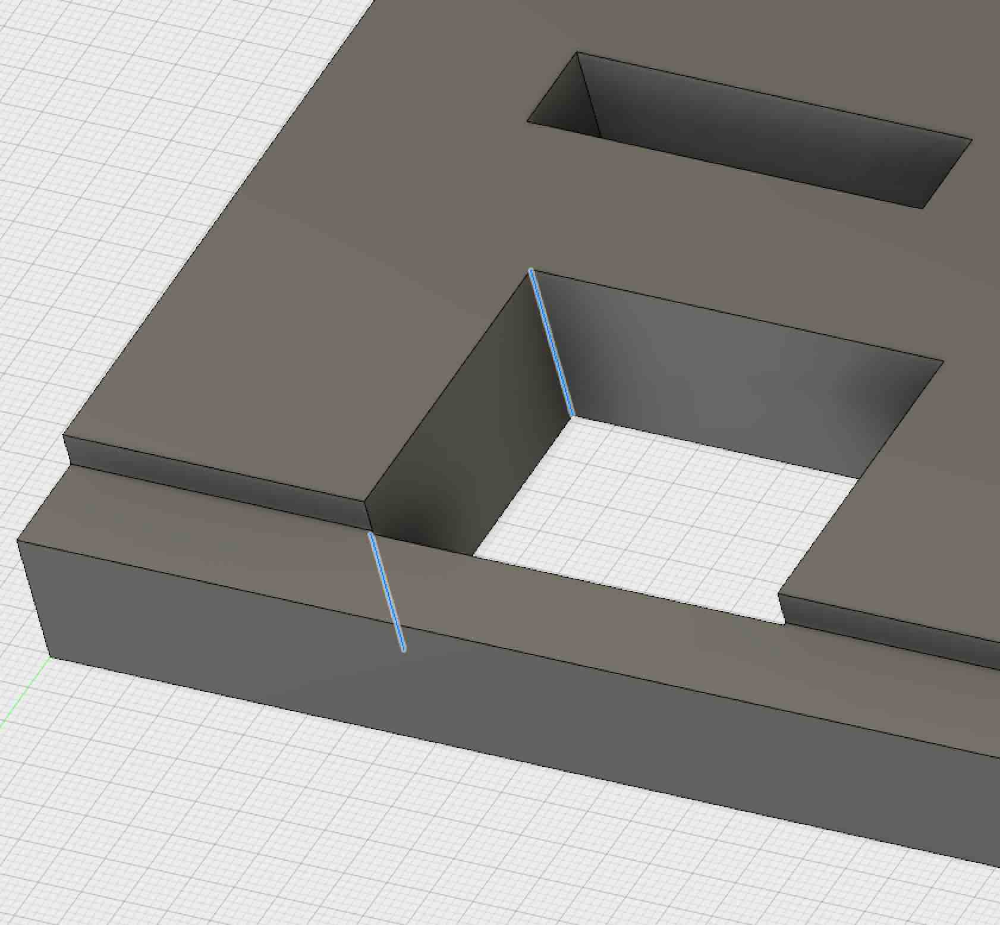

# Dogbone

A Fusion360 addin that creates dogbone joints for wood joinery.

## Changes

This version has been significantly optimized as follows:
- Instead of generating one plane, sketch, and sweep cut for each dogbone, it groups the dogbones by their vertical
  extents and produces the minimum number of features in the history tree as possible.
- Introduced "Output Unconstrained Geometry" option to directly compute the locations of dogbone circle in the sketch,
  producing the minimum amount of sketch geometry possible. This led to a >5x speedup of generating each dogbone.

The net result is that, for my use case, I can generate 208 fillets in 28 objects in 73 sec. Since they are all lying
in the same plane, it only generates three history operations (plane, sketch, extrusion). Previously this would take
forever, freeze the UI, and generate 600+ operations in the history.

Note: The bulk of the time is because every call to the Fusion API (adding geometry, extrusions, etc.) is extremely
slow.

Additionally, other enhancements were added:
- Progress bar shows current status.
- The operation can be canceled midway (use Undo to delete the partial geometry created).
- Saves the last parameters used (cleared on relaunch of Fusion)
- Skips non-vertical edges selected.
- Benchmarking
- Code is refactored into object-oriented fashion to be more manageable, and utility functions split out.
- Robustness: Exception handling is consolidated, tracebacks always shown, launching the plugin automatically cleans up
  old crashed instances of the plugin.

New enhancements by DVE2000:
- Add options to create dogbones along the longest side or shortest side of a mortise. This is useful when using non-through
  mortises and you'd like the required holes to be hidden by the tenon. Or even just for looks.
- Add option to create a minimal Dogbone. See http://fablab.ruc.dk/more-elegant-cnc-dogbones/
  The default offset percent is 10%, but it can be changed from 8% to 14.2%.
- Dogbones can be created on any of the three X, Y, or Z planes at one time. If you run the Add-In 3 times, trying 
  each plane, you can create all the dogbones for a 3D assembly. There's a cautionary note in the limitations section below.
- The Add-In now remembers all your inputs from the last time dogbones were created. Even on Fusion 360 restarts.
  If you ever want to get to the absolute default settings, delete the defaults.dat file in the Add-In install directory,
  while the Dogbone dialog box is closed.
- There's an option to try limit the dogbones to selected bodies or bodies of selected edges. It can be useful if
  you have an assembly and dogbones are cut where they shouldn't be. This was not an option in a previous release,
  but it was present and caused dogbones to not be cut for at least one user. (Confirmed bug opened at Autodesk. Default is on.)
- For selected bodies ONLY, you can now specify the minimum and maximum edge angles in degrees that will be included in dogbone
  cuts. The default is 80 degrees minimum and 100 degrees maximum. This means for any corners in a selected body that have at
  least an 80 degree angle (included) up to a 100 degree angle (100 degrees is not included), dogbones will be cut. Any edges that
  are less than 80 degrees or greater or equal to 100 degrees will be left alone. Fillets should no longer be cut. If you 
  want dogbones on only 90 degree corners, set the minimum angle to 90 degrees and the maximum angle to 91 degrees.
- Constrained dogbone creation is now working properly! This means that if you clear the "Output Unconstrained Geometry" checkbox, while the 
  dogbone creation will be very slow and could even bog down, once you change parameters or sizes for items in the underlying sketch,
  the dogbones will move properly with the corners.

## Limitations
If you run dogbones on an entire body, if the body has holes in other faces, you'll get dogbones created in unexpected places. You'll also
get partial dogbones on steps. See the following blue highlights:

(I did create a solution for steps, but I'm not releasing it yet. Fusion sometimes acts weirdly with extended dogbones on steps, even giving
the incorrect part of the shape for where to create the dogbones. That happened in the design shown in the next paragraph.)

Also, if you have something like the design below, you won't be able to create dogbones by selecting the body. You'll get a traceback dialog. 
Make sure to just select edges of the same heights before creating the dogbones. See a problematic edge selection below:

Still TODO:
- Handle acute angles (<90deg) by generating a slot.
- Allow user to specify orientation (i.e. select "vertical" vector) instead of only handling edges (i.e. in the X, Y or Z direction only).
- Handle duplicate edges (avoid generating duplicate overlapping geometry)
- Selecting a body instead of edges for steps in the design

## Usage:

First see [How to install sample Add-Ins and Scripts](https://rawgit.com/AutodeskFusion360/AutodeskFusion360.github.io/master/Installation.html)

See a youtube video of using this app here:
http://youtu.be/EM13Dz4Mqnc

Select edges interior to 90 degree angles. Specify a tool diameter and a radial offset.
The add-in will then create a dogbone with diamater equal to the tool diameter plus
twice the offset (as the offset is applied to the radius) at each selected edge.
Alternatively, select an entire body and the add-in will automatically apply a dog-bone to all interior vertical edges.

## License

Samples are licensed under the terms of the [MIT License](http://opensource.org/licenses/MIT). Please see the [LICENSE](LICENSE) file for full details.

## Written by

- Original version by Casey Rogers: http://github.com/caseycrogers/Dogbone
- Modified by Patrick Rainsberry (Autodesk Fusion 360 Business Development)
- Modified by David Liu (http://github.com/iceboundflame/)
- Modified by DVE2000: http://github.com/DVE2000/Dogbone
