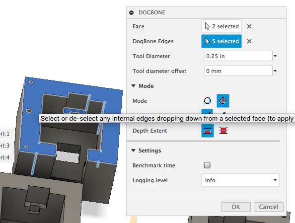

Dogbone
===

## Version: 2.0

You can download a self extracting file [here](https://github.com/DVE2000/Dogbone/releases/download/v2.0/setup_Dogbone_v2_0.exe)

---

## Description

This addin includes 3 dogbone styles (normal, minimal and mortise) and allows dogbones to be cut from either the topface or selected face.  Both static and parametric options are available - however due to a number of bugs in F360, parametric will fail on mirrored components and some component copies.  These bugs have been reported (see [here](https://forums.autodesk.com/t5/fusion-360-api-and-scripts/4-bugs-at-least-related-to-occurrences/m-p/8105766#M6240)), but as of writing AD has not addressed them.

The interface has been improved, and specifically allows any face orientation to be chosen on any component.  The addin is based on the f360 primitive hole feature, and is as efficient as f360 single threaded engine allows.  In Static mode it will create 70 dogbones in about 7 seconds.  Parametric mode takes a little longer to calculate initially, but recalculation is very fast if you change your model parameters.  Of course, speed also depends on the processing power of you computer.

---

## Notes:

This version should work with all static dogbones. Parameterized dogbones mostly work, but there are definite issues with the Fusion360 API that may cause problems when trying to create dogbones. If that happens, you can create a logfile and post it here to let us know. If it turns out that it **is** a Fusion360 bug, please report it to Autodesk.

---

Dogbones has been completed revamped. Some of the original utilities have remained, as well as some original mathematical formulaes, but mostly everything else has changed.

The original add-in was based on creating sketches and extruding - Peter found using this approach to be very heavy on processing resources, so this version has been designed to create dogbones directly by using a hole tool.

---

**This version should work with all static dogbones. Parameterized dogbones mostly work, but there are definite issues with the Fusion360 API that may cause problems when trying to create dogbones. If that happens, you can create a logfile and post it here to let us know. If it turns out that it **is** a Fusion360 bug, please report it to Autodesk.**

---

**WARNING: use at your own risk.**

**The code provided is provided "as is" and with all faults. We specifically disclaim any implied warranty of merchantability or fitness for a particular use. The operation of the code provided is not warranted to be uninterrupted or error free.**

---

## Installation

See [How to install sample Add-Ins and Scripts](https://rawgit.com/AutodeskFusion360/AutodeskFusion360.github.io/master/Installation.html)

## Instructions
**Note that you can hover your cursor over any Dogbone dialog item and you will get an explanatory popup in Fusion360.**

1. Select the face(s) you want the dogbones to drop from. The add-in will only allow you to select appropriate and/or parallel faces for the body, once a primary face has been selected. The orientation of the primary face for unique components or bodies may be in any direction.
   
2. All edges associated with the selected face will be automatically selected. You can select the "Dogbone Edges" selector in the Dogbone popup, and that will allow you to deselect or reselect only internal edges. **Note that only internal edges belonging to a selected face can be selected or deselected.**
   
3. Specify a tool diameter and a radial offset.
4. Select the Mode - Static Dogbones or Parameterized Dogbones. Parameters are created for the second mode - dogbones will move with edge changes, and you can change diameter or offset from the normal "Change Paramaters" dialog.
5. Choose the type of dogbone - Normal, Minimal or Mortise. See http://fablab.ruc.dk/more-elegant-cnc-dogbones/ for a description of minimal dogbones. Mortise dogbones place the dogbones along the sides, so that they can be hidden by a connecting piece with a cut tenon. Minimal and Mortise dogbones have their own option lines become visible when selected.
6. Decide if you'd like dogbones to be cut to the top. (Useful if you have steps, but can't do two sided machining.)
    
7. You can expand Settings and specify if you'd like to see benchmark time or do any logging. 
8. Click ok.

The add-in will then create the specified dogbones. If you choose parameterized, the critical dimensions are maintained in the parameters - so you can change the dimensions as and when needed.

* If you need dogbones in different orientations for the same body, you'll have to run the addin once for each direction.
* The direction for egdes for a body is locked onve *any* face is selected. De-select all faces if you want to change edge selection direction.
* Edges are selected **down** from a face. Generally, selecting a bottom face will not add any edges, but de-selecting one may remove some edges.

## To do:
1. Handle acute angles (<90 degrees) by generating a slot.
2. ... who knows

## License

Samples are licensed under the terms of the [MIT License](http://opensource.org/licenses/MIT). Please see the [LICENSE](LICENSE) file for full details.

## Authors
Peter Ludikar (pludikar), Gary Singer (DVE2000), Casey Rogers (casycrogers)
- Original version by Casey Rogers: https://github.com/caseycrogers/Dogbone/tree/cbe8f2c95317ae7eded43fee384171a492c6900e
- Original version Modified by Patrick Rainsberry (Autodesk Fusion 360 Business Development)
- Original version Modified by David Liu (http://github.com/iceboundflame/)

